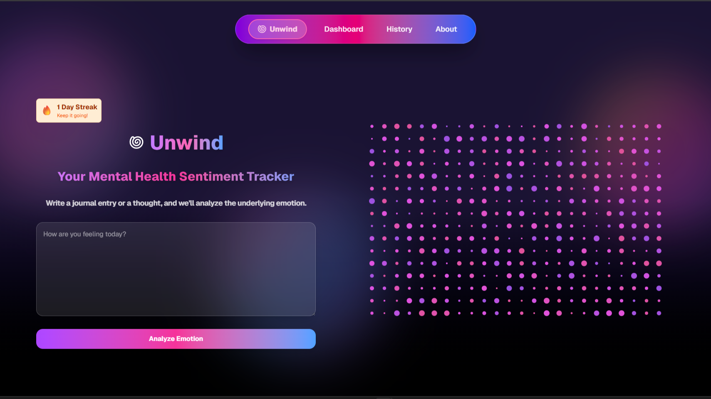
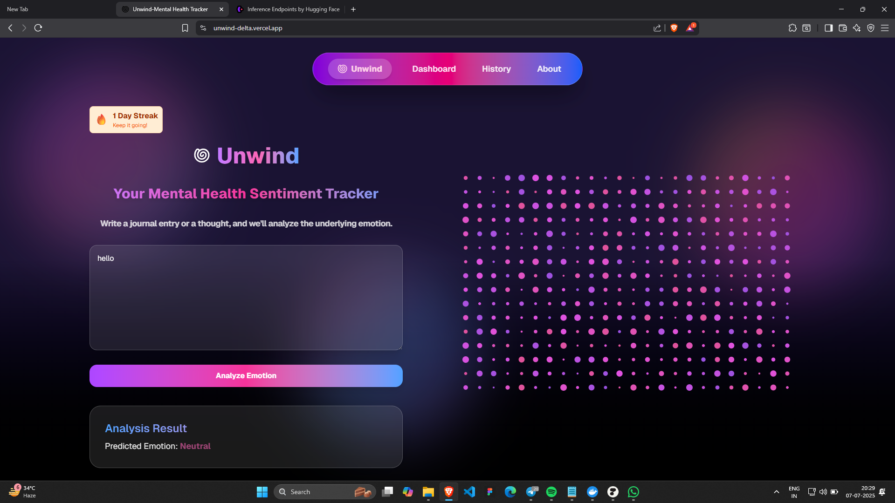
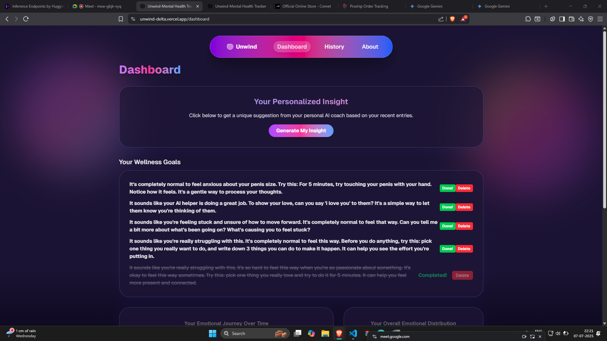
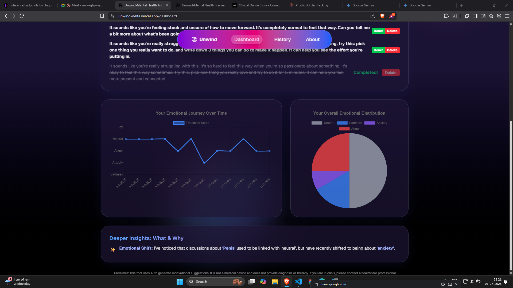
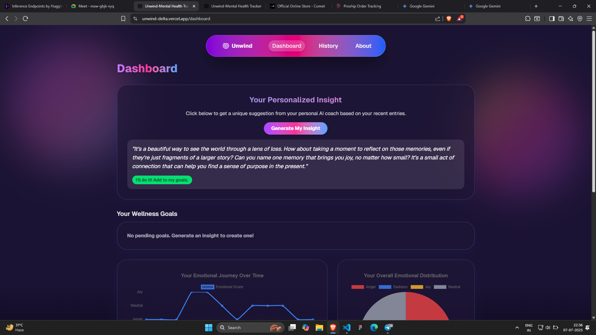
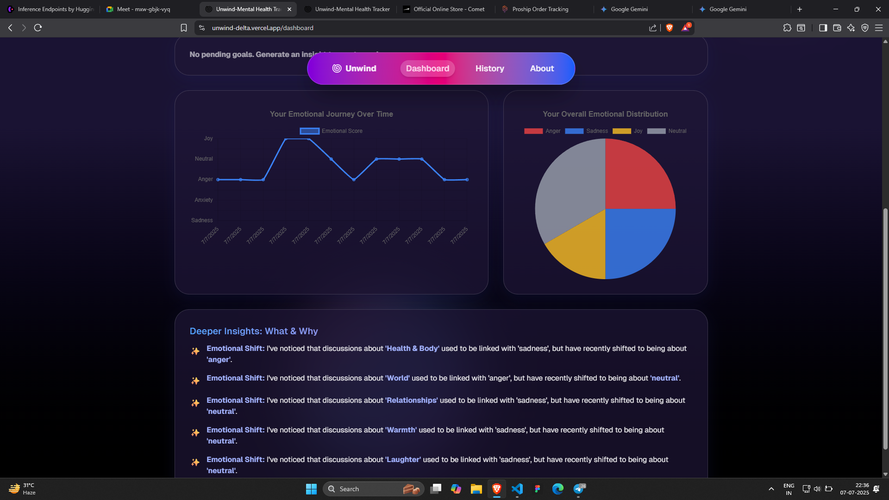
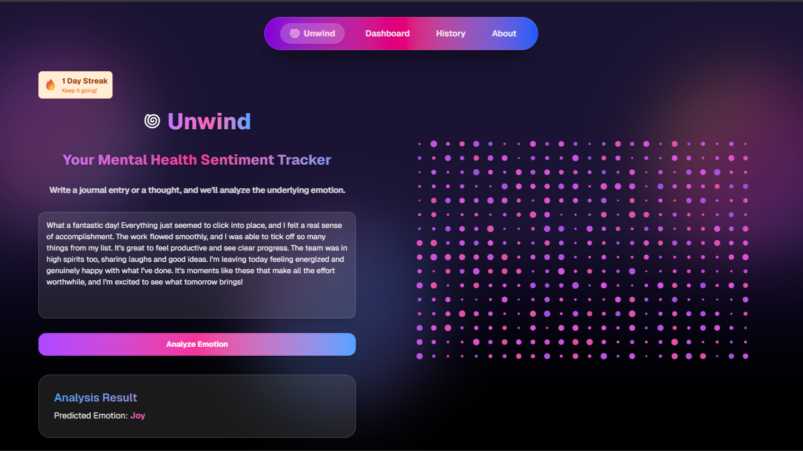
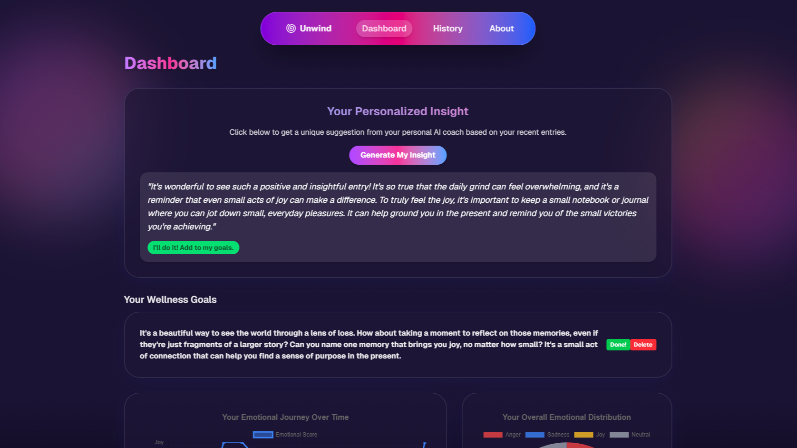

# Mental Health Sentiment Tracker & AI Coach

This is a full-stack web application designed to help users track their emotional well-being through journaling and receive personalized, AI-driven insights and suggestions. The app uses a multi-layered AI system to understand user entries, generate empathetic feedback, and uncover deep, time-based patterns in their emotional journey.

 
 
 
 

## Core Features

-   **Sentiment Analysis:** Automatically detects the primary emotion (e.g., joy, anxiety, sadness) in a user's journal entry.
-   **AI-Powered Suggestions:** A custom-trained AI coach provides personalized suggestions based on recent emotional patterns.
-   **Data Visualization:** An interactive dashboard with line and pie charts to visualize emotional trends over time.
-   **Deeper Insights Engine:** A "Time-Aware Analyst" that identifies shifts and trends in how topics (like 'Work' or 'Relationships') correlate with emotions over time.
-   **Gamification:** A streak counter to encourage consistent daily journaling.
-   **Goal Setting:** Users can turn AI suggestions into actionable goals and track their completion.

## Tech Stack & Architecture

This project uses a modern, decoupled architecture with a Next.js frontend and a Python backend.


### Frontend

-   **Framework:** [Next.js](https://nextjs.org/) (React)
-   **Styling:** [Tailwind CSS](https://tailwindcss.com/)
-   **Data Visualization:** [Chart.js](https://www.chartjs.org/) with `react-chartjs-2`
-   **Deployment:** [Vercel](https://vercel.com/)

### Backend

-   **Framework:** [Flask](https://flask.palletsprojects.com/)
-   **Database:** [MongoDB Atlas](https://www.mongodb.com/atlas)
-   **AI Libraries:** `Hugging Face Transformers`, `PyTorch`, `PEFT`, `spaCy`
-   **Deployment:** [Render](https://render.com/)
## AI/ML Specifications

This project's intelligence is powered by a pipeline of three distinct AI/ML models and logical engines working in concert.

### 1. Sentiment Analysis Engine

-   **Model:** A fine-tuned `DistilBERT` model.
-   **Task:** Multi-class text classification. This model reads a journal entry and classifies it into one of several core emotions.
-   **Why `DistilBERT`?** We chose DistilBERT because it offers an excellent balance between performance and accuracy. It's a smaller, faster version of the famous BERT model, making it ideal for a responsive web application without sacrificing the quality of its emotional understanding. It was fine-tuned on the `GoEmotions` dataset to specialize in recognizing nuanced emotional language.

### 2. Personalized Suggestion Engine (Custom SLM)

This is the heart of the application's generative capabilities. Instead of relying on a third-party API, we built our own specialized coach.

-   **Model:** A fine-tuned version of `Qwen/Qwen1.5-0.5B`, a powerful and efficient Small Language Model (SLM).
-   **Task:** Instruction-following and generative text. It takes a user's recent emotional history as input and generates a unique, empathetic, and actionable suggestion.
-   **Training Method:**
    -   **Instruction Fine-Tuning:** The model was not trained from scratch. Instead, it was "instruction-tuned" on a bespoke, custom-created dataset of `instruction -> input -> perfect response` examples. This taught the model a specific "personality"—that of a supportive wellness coach.
    -   **PEFT/LoRA:** To make this training process efficient, we used a technique called **Parameter-Efficient Fine-Tuning (PEFT)** with **Low-Rank Adaptation (LoRA)**. Think of this as performing precise "brain surgery" on the model rather than a full brain transplant. It allows us to adapt the model to our specific task with minimal computational cost, making it possible to train on a single GPU.

### 3. Deeper Insights Engine

This engine moves beyond single entries to analyze the user's entire journaling history, answering the question "Why do I feel this way?"

-   **Tool:** The [spaCy](https://spacy.io/) NLP library.
-   **Task:** Topic-Emotion Correlation and Trend Analysis.
-   **How it Works:**
    1.  **Smarter Topic Extraction:** It uses a combination of keyword matching (for abstract concepts like 'Work' or 'Health'), Named Entity Recognition (for people and places), and Part-of-Speech tagging (for important nouns) to identify what each journal entry is about.
    2.  **Time-Aware Analysis:** Its most powerful feature is its ability to compare two periods (e.g., the first half of entries vs. the second half). It then identifies meaningful patterns like **Emotional Shifts** (a topic's associated emotion has changed) or **Emerging Challenges** (a topic has recently become a source of negative emotion).

## Getting Started

### Prerequisites

-   Node.js (v18+)
-   Python (v3.11+)
-   A MongoDB Atlas account

### Local Installation & Setup

1.  **Clone the repository:**
    ```
    git clone https://github.com/your-username/mental-health-tracker.git
    cd mental-health-tracker
    ```

2.  **Setup Frontend:**
    ```
    npm install
    ```

3.  **Setup Backend:**
    -   Create and activate a Python virtual environment:
        ```
        python -m venv venv
        source venv/bin/activate  # On macOS/Linux
        # .\venv\Scripts\activate   # On Windows
        ```
    -   Install Python dependencies:
        ```
        pip install -r backend/requirements.txt
        python -m spacy download en_core_web_sm
        ```

4.  **Environment Variables:**
    -   Create a `.env` file in the project root.
    -   Add your MongoDB connection string to it:
        ```
        MONGO_URI="your-mongodb-connection-string"
        ```

5.  **Run the Application:**
    -   **Terminal 1 (Backend):**
        ```
        python backend/api.py
        ```
    -   **Terminal 2 (Frontend):**
        ```
        npm run dev
        ```

Open [http://localhost:3000](http://localhost:3000) in your browser to see the app running.
